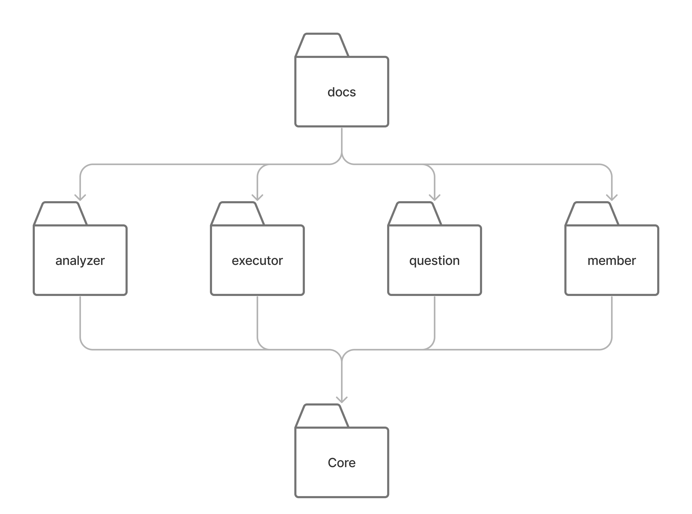

# coding-challenge

자신의 코드를 채점할 수 있는 서비스입니다.

## Description

### Goal

- 멀티 모듈로 구현합니다.
- 단위 테스트는 spork 로 관리합니다.
- API 문서는 `Rest Docs`로 `docs`에서 관리합니다.
- 테스트는 `Intellij TMS`로 관리합니다.
- 배포 파이프라인을 `Github Actions`로 구성합니다.

### Language

- Java 17
- Groovy
- Gradle

### Library

- Spring Boot 3.0.5
- Spring Web Mvc
- Spring RestDocs
- Spork framework
- lombok

### CI Tool

- Github Actions

### Test Management Toole

- Intellij TMS

## Directory Structure

<details>
<summary> Show Directory Structure </summary>
<div>
        
```plain text
        .
        ├── analyzer
        │   └── src
        │       ├── main
        │       │   ├── java
        │       │   └── resources
        │       └── test
        │           ├── groovy
        │           │   └── analyzer
        │           ├── java
        │           │   └── analyzer
        │           └── resources
        ├── executor
        │   └── src
        │       ├── main
        │       │   ├── java
        │       │   │   └── code
        │       │   └── resources
        │       └── test
        │           ├── groovy
        │           │   └── code
        │           ├── java
        │           │   └── code
        │           └── resources
        ├── member
        │   └── src
        │       ├── main
        │       │   ├── java
        │       │   │   └── member
        │       │   └── resources
        │       └── test
        │           ├── groovy
        │           │   └── member
        │           ├── java
        │           │   └── member
        │           └── resources
        ├── question
        │   └── src
        │       ├── main
        │       │   ├── java
        │       │   │   └── api
        │       │   └── resources
        │       └── test
        │           ├── groovy
        │           │   └── api
        │           ├── java
        │           │   └── api
        │           └── resources
        ├── core
        │   └── src
        │       ├── main
        │       │   ├── java
        │       │   └── resources
        │       └── test
        │           ├── groovy
        │           ├── java
        │           └── resources
        ├── docs
        │   ├── build.gradle
        │   └── src
        │       ├── docs
        │       │   └── asciidoc
        │       └── test
        │           ├── java
        │           │   └── docs
        │           │       ├── analyzer
        │           │       ├── executor
        │           │       ├── member
        │           │       └── question
        │           └── resources
        ├── dockerfiles
        │   ├── analyzer
        │   ├── executor
        │   ├── member
        │   └── question
        └── tests
            ├── checklists
            ├── release
            └── test-cases
```
</div>
</details>

### Directory dependency structure



